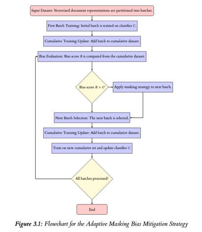

## Overview of Adaptive Masking

This GitHub repo serves as the primary location of all code related to my dissertation work, which
proposes a new in-processing bias mitigation strategy in the form of adaptive masking.
 ### Adaptive Masking Description (Extract from Dissertation)

Adaptive masking is a novel in-processing bias mitigation technique designed to respond to bias
as it emerges through the use of masking. This method differs from static masking approaches,
which apply a predefined transformation to sensitive attributes; instead, it responds to bias
throughout the training of a model.

The process begins by partitioning a collection of vectorized document representations into multiple batches, which serve as incremental training units. Each batch is selected based on a predefined strategy, either random selection, correlation-based selection, or distribution-based selection. This partitioning enables regular bias assessment and intervention throughout the training process.
After selecting the first batch, an initial classifier 𝐶 is trained. The classifier is then evaluated
against a held-out set to compute a bias score 𝐵 (using metrics such as Statistical Parity Difference
or Equal Opportunity Difference), which quantifies the bias concerning the sensitive attribute 𝑆.
If 𝐵 exceeds a predefined threshold 𝜏, the appropriate masking strategy is applied to the subsequent
batch. In the baseline masking approach, the sensitive attribute is replaced by a constant masking
value 𝑚, thereby neutralizing its influence. In the expanded masking strategy, additional proxy
attributes that are highly correlated with 𝑆 are masked as well.

Each processed batch—masked or unmasked—is then incorporated into a cumulative training
dataset, which is used to re-train the classifier in subsequent iterations. This iterative procedure
continues until all batches have been processed

 ### Adaptive Masking Flowchart


## Requirements (also found in requirements.txt)

```
pip~=23.2.1
attrs~=23.2.0
wheel~=0.45.0
protobuf~=5.28.3
cryptography~=42.0.8
pillow~=10.2.0
filelock~=3.16.1
pandas~=2.2.3
scikit-learn~=1.5.2
aif360~=0.6.1
numpy~=2.0.0
matplotlib~=3.9.0
seaborn~=0.13.2
scipy~=1.14.1
tqdm~=4.67.1
statsmodels~=0.14.4
lightgbm~=4.6.0
xgboost~=2.1.4
tensorflow~=2.18.0
```

## Adaptive Masking and Baseline

The adaptive masking class is defined in the `adaptive_masking` folder with the `adaptivebaseline.py` file defining the class itself, `bias_metrics.py` defining the metric used in the evaluation, and `main.py` providing a function to run and evaluate adaptive masking on a given dataset/model

The baseline is defined in the `baseline` folder with the `baseline.py` file defining the run itself and `main.py` providing a standard run which gives baseline results for the given dataset(s)/model

## Running Experiments

Each experiment has a `main.py` file, which runs all the associated files with that experiment and outputs the results as a `.csv` file in the same directory. All results are already in each directory but are replaced when running the experiment anew

- Comparison of Batch Selection Strategies
    - Found in the `batching_strategies` folder, the batching strategies are defined in `batching_strats.py`
- Comparison of Batch Sizes
    - Found in the `epoch_comparison` folder
- Comparison of Attribute Masking Strategies
    - Found in the `masking_strategies` folder, masking strategies are defined in `masking_strategies_def.py`
- Comparison of Masking Values
- Found in the `masking_comparison` folder
- Comparison of Adaptive Masking Across Models
    - Found in the `model_generalisability` folder
    - Additional Models used are
        - SVC (Linear Kernel) -  Sourced from https://scikit-learn.org/stable/modules/generated/sklearn.svm.SVC.html
        - XGBC Classifier - Sourced from https://xgboost.readthedocs.io/en/stable/
        - MLP Classifier -  Sourced from [https://scikit-learn.org/stable/modules/generated/sklearn.svm.SVC.html](https://scikit-learn.org/stable/modules/generated/sklearn.neural_network.MLPClassifier.html)
- Comparison of Adaptive Masking against Other Mitigation Strategies
    - Found in the `other_mitigation` strategies folder
    - Other mitigation strategies used include
        - LFR
            - Sourced from https://aif360.readthedocs.io/en/stable/modules/generated/aif360.algorithms.preprocessing.LFR.html#aif360.algorithms.preprocessing.LFR
            - Relevant Paper: https://proceedings.mlr.press/v28/zemel13.html
        - Prejudice Remover
            - Sourced from https://aif360.readthedocs.io/en/stable/modules/generated/aif360.algorithms.inprocessing.PrejudiceRemover.html#aif360.algorithms.inprocessing.PrejudiceRemover
            - Relevant Paper: https://link.springer.com/chapter/10.1007/978-3-642-33486-3_3
        - Adversarial Debiasing
            - Sourced from https://aif360.readthedocs.io/en/stable/modules/generated/aif360.algorithms.inprocessing.AdversarialDebiasing.html#aif360.algorithms.inprocessing.AdversarialDebiasing
            - Relevant Paper: https://dl.acm.org/doi/10.1145/3278721.3278779
